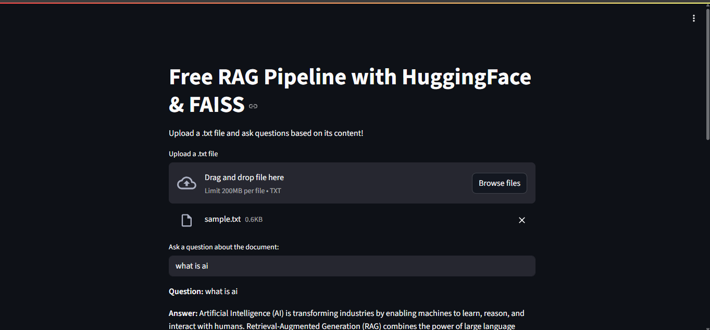

# 🔍 Free RAG Pipeline: HuggingFace Transformers + FAISS + Sentence Transformers

<p align="center">
  
  
  
</p>

> 💡 Build a Retrieval-Augmented Generation (RAG) pipeline with **no paid APIs**.  
> Embed, store, and query your documents locally using FAISS and HuggingFace — 100% free & open source.

---

## 🧠 What is This?

A minimal, efficient **RAG (Retrieval-Augmented Generation)** system using only:
- 🧠 [SentenceTransformers](https://www.sbert.net/) for embedding documents
- 🔎 [FAISS](https://faiss.ai/) for local vector search
- 🤖 [FLAN-T5](https://huggingface.co/google/flan-t5-base) via HuggingFace Transformers as the language model

No OpenAI, no Pinecone, no paid APIs.

---

## 📂 Project Structure

```
free_rag_pipeline_faiss/
├── streamlit_app.py          # Streamlit frontend (optional)
├── free_rag_pipeline.ipynb   # Colab-ready notebook
├── example.txt               # Sample document (can be replaced with PDF)
└── README.md                 # You're here
```

---

## 🚀 Features

- ✅ 100% free & offline-compatible
- ✅ HuggingFace open-source models only
- ✅ Local vector DB using FAISS
- ✅ Document chunking + embedding with `all-MiniLM-L6-v2`
- ✅ Context-aware question answering via `flan-t5-base`

---

## 🔧 How It Works

1. **Load a document** (text, PDF, or scraped data)
2. **Split into chunks** using LangChain's `TextSplitter`
3. **Generate embeddings** with `sentence-transformers`
4. **Store in FAISS index** locally
5. **Query with a user question** → retrieve top-K chunks
6. **Prompt the LLM** with retrieved context using `google/flan-t5-base`

---

## 📊 Example

```python
Q: What is LangChain?
A: LangChain is a framework for building applications powered by language models and external tools like APIs and vector databases.
```

---

## 🛠️ Requirements

```bash
pip install sentence-transformers faiss-cpu transformers langchain unstructured pdfminer.six
```

> 💡 Use inside [Google Colab](https://colab.research.google.com) for best results (GPU acceleration optional but helpful).

---

## 📘 Future Add-ons

- [ ] PDF upload support via `Unstructured` or `PyMuPDF`
- [ ] Switchable models (e.g., Mistral, LLaMA 3 via Transformers)
- [ ] Add ChromaDB backend as alternative to FAISS

---

## 🌐 Try the Streamlit App

### 🖼️ Live App Preview




You can test the full pipeline using a simple UI built with [Streamlit](https://streamlit.io). Upload a text file, ask a question, and get context-aware answers from a local model.

> 📍 Run it locally with:
```bash
streamlit run streamlit_app.py
```

> 🧠 No OpenAI or paid APIs used — 100% free using HuggingFace + FAISS.

> 📁 File: `streamlit_app.py`

---

## 🤝 Contributing

Contributions welcome, fork this repo, improve the pipeline, or try new models!  
If you like it, consider ⭐️ starring and sharing.

---

## 📫 Author

**Muhammad Taha Nasir**  
💼 Aspiring AI Engineer | RAG Systems | Open Source  
🌐 [LinkedIn](https://linkedin.com/muhammadtahanasir) · [GitHub](https://github.com/MuhammadTahaNasir) · [Kaggle](https://kaggle.com/muhamadtahanasir)
